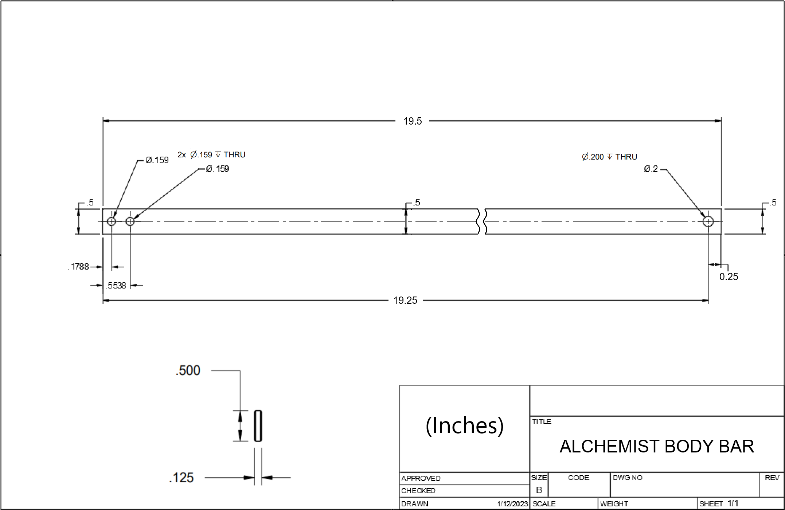

# Alchemist
Alchemist is the next step in the evolution of 3d printed pump action springers.

Changelog (click this text, it's a dropdown!)

- Changelog: 10-14-2023: Blaster release.
  

## Description
Alchemist is the next step in the evolution of 3d printed pump action springers. Alchemist is built like a tank, has a butter smooth priming and firing feel, and is heavily customizable with alternative parts and upgrades. 

Firing Demo & Blaster Overview: https://www.youtube.com/watch?v=2bPMUlzL2F4

Pre-Release Compilation: https://youtu.be/aXrQAO-OECE

Assembly Video: https://youtu.be/UOdZIeP3myw

## "Why would I build this instead of XYZ?"

* It uses ball bearings on the priming grip, and the prime is VERY smooth.
* There is an (optional) ball detent that locks the priming grip in the forward position, so it doesn't flop around while running. Flopping is an issue experienced by most pump action springers (Talon Claw, SBL, Lynx, etc etc).
* One pin and one allen key screw to access the spring, plunger, and ram.
* The blaster is built on aluminum bars, like a Lynx. Very sturdy.
   * It also has a bar tensioner, which squeezes all the parts together like a Caliburnoid. Best of both worlds.
* Hair trigger, very quick and snappy.
* The barrel can be removed and replaced in 10 seconds, toolless.
   * If you don't care about doing barrel swaps fast, there's also an optional set screw that goes directly into the barrel, for a more permanent attachment.
* Very smooth magwell with plenty of flare for quick reloading.
* Several different stock options:
   * Compatible with the SBL/Worker adjustable stock.
   * Skeggox stock (adapted from Vikinger) - this is what is pictured in the post.
   * N-Strike lug.
   * Fixed, non adjustable printed stock, with different buttplate length options
   * Or no stock, if you don't want one lol.
* A bunch of different aesthetic and ergonomic options for the shroud, grip, plunger tube area, and magwell.
* A SLAB style plunger fits wider Lynx springs, *and* all TC springs. Lots of options.
* The blaster has a 95mm prime, which is slightly shorter than a SBL, and a good bit shorter than a TC. That allows faster priming.
* Built in spring guide as the plunger rod.
* It uses a Skewer plunger tube, so it can use metal Skewer plunger tube upgrades.
* It also uses TC ramrods, so you can use fancy anodized ones.
* The rambase is improved over a TC rambase; it has more screws to grab onto the ram.
* Very easy printing, with minimal supports.
* The picatinny rail on top has a big iron sight gutter down the middle, so you can easily aim even without any picatinny irons or a proper sight.

And more I can't remember at the time of writing. Its a good blaster, build one.

## I don't charge for my files, please consider supporting me! 

**If you enjoy the stuff I make, please consider donating via Patreon or BuyMeACoffee. Filament and prototyping stuff costs a lot! By donating, I can make more cool stuff for everyone to enjoy. Thanks!**

 
https://www.patreon.com/sillybutts Monthly donations

 
https://www.buymeacoffee.com/sillybutts One-time donations

## Reviews

Videos:
None yet, the blaster just released! Give it some time :P

## User Images

Here's some awesome builds of Alchemist!

## Optional Parts

There are a bunch of variant parts for Alchemist:
- Front Ends:
- - Standard ported front shroud, or "swiss cheesed" front shroud.
- Four grip styles:
- - Standard grip, with and without the bottom "shoe" portion.
- - Lynx-derived grip, with and without the bottom "shoe" portion.
- Four stock styles:
- - Skeggox adjustable stock, originally designed by Vikinger, and ported to Alchemist by Chance.
- - Worker/SBL1.0 Adjustable stock (thanks GavinFuzzy for help with this part).
- - Fixed non-adjustable stock with buttpads of varying height.
- - N-Strike Stock Lug.
- Optional front grip.
- Magwell panels with or without viewing slots.
- etc

Here are some good Picatinny sights if you want some:
- https://www.thingiverse.com/thing:2376150/files FrontPip and Pip in the Caliburn fileset are great iron sights.
- https://www.thingiverse.com/thing:1667830
- https://www.thingiverse.com/thing:2829229
- https://www.thingiverse.com/thing:5103083

### Performance:
As testing is done, I will update this part of the page with common spring/barrel combos for specific FPS numbers.

Keep in mind that SCARs usually reduce performance a bit.

Broadly speaking, expect a reliable and consistent FPS range of 120fps to 260fps, depending on spring and barrel combo. 

Alchemist is compatible with Talon Claw length springs, as well as larger Lynx and Nerf Longshot springs.

Expect Alchemist to hit ~20 FPS lower than a TC with an equivalent barrel and spring. Alchemist traded a shorter prime length for a smoother prime, which means there's less air volume to work with.

## Sellers

Hardware is available from these sellers:
- OutOfDarts: https://outofdarts.com/products/alchemist-hardware-kit
- - OOD aluminum bar sets: https://outofdarts.com/products/sillybutts-replacement-bolt-arms

- SilverFoxIndustries: https://silverfoxindustries.shop/products/alchemist-hardware-kit

Fully printed/assembled blasters are available from these sellers:
- OutOfDarts: WIP
- SilverFoxIndustries: https://silverfoxindustries.shop/collections/designs-by-sillybutts/products/the-alchemist-by-sillybutts

## Print Info

All STLs are exported in their correct print orientations.

Black
- 100% infill, 5 walls: MagwellChin, PlungerRod, NStrikeLug.
- 10% infill, 5 walls: FixedStock_Buttplate, TriggerGuard.
- Everything else 20% infill, 5 walls
- Supports needed for MagwellChin and NStrikeLug. RailA/B/C has built in supports, no slicer supports required.
- MagwellChin MUST BE PRINTED WITH A BRIM AND SUPPORTS, and with the long bottom area facing the print bed. 

Green
- 100% infill, 5 walls: EndCap
- 10% infill, 5 walls: FixedStock_Stock.
- Everything else 20% infill, 5 walls
- Supports needed for BarrelShroudFront, BarrelShroudBack.
- EndCap is intended to print with the back facing the print bed, but it can be printed with the opposite face on the print bed if you enable supports.

Orange
- 20% infill, 5 walls: FrontGripKeeper, MagRelease, MuzzleNut, Trigger, PrimingBlock.
- Everything else 100% (full) infill, 5 walls
- No supports.
- Muzzle needs to be printed with the front facing the print bed.
- BarTensioner needs to be printed with the nut-cavity facing up.
- Brims are very helpful for printing all these orange parts.
- PrimingBlock has some overhangs, but nothing too awful. DO NOT USE SUPPORTS ON IT.

## Hardware

Full hardware list: https://docs.google.com/spreadsheets/d/1YDkzYdij77of0HTidGjQzjRrs53viwXQVmcyhZj8VQ8/edit?usp=sharing
Make sure you have the "RELEASE VERSION" tab selected at the bottom of the page.

The "Body Aluminum Bars" are custom for this blaster. Here is a diagram of the bars if you plan to make your own. 

There is a printable cutting/drilling jig in the Tools folder of the Alchemist fileset. 

Pre-made bars can also be bought directly from:

- SilverFoxIndustries: https://silverfoxindustries.shop/products/individual-flatbar-replacement?variant=42696345714874

- OutOfDarts: https://outofdarts.com/products/sillybutts-replacement-bolt-arms?variant=40599008739370

## Assembly

Video: https://youtu.be/UOdZIeP3myw?si=pLHplAR6F4LWGuP2

Full hardware list: https://docs.google.com/spreadsheets/d/1YDkzYdij77of0HTidGjQzjRrs53viwXQVmcyhZj8VQ8/edit?usp=sharing
Make sure you have the "RELEASE VERSION" tab selected at the bottom of the page.

## Project Contributors

Thanks to the people who contributed to Alchemist! Here's a list of who did what (in no particular order): (click this text)

Beta:
- SuperStressed: Beta testing.
- Chance: Emotional support (Chance — 06/11/2023 8:16 PM: "succa my nut", 07/07/2023 5:48 PM: "lofts can suck my whole ass"). Adapted Vikinger's Skeggox stock to fit Alchemist. Did a bunch of work optimizing the positioning of the primingblock bearings.
- zoomed_out_tahova: Beta testing.
- Wonderboy: Misc help.
- Hollebread: Beta testing.
- RedCowl: Misc help.
- Meaker VI: Did some fun stuff with the initial prototype. None of it made it back into the main design, but it's still pretty neat.
- TriangleFabrications: Misc help.
- Ian Whitehouse: Misc help.
- OOD Greg: Testing help and sourcing help.
- Hotkoin: Aesthetic assistance. 

## Misc.

**If you build any of my designs, I'd love to see yours! Feel free to message me on Discord (Sillybutts#5905) or tag me on a post on Reddit (u/SillyTheGamer).**

**If you are having issues with any of my designs, please let me know.**

**If you wish to print and sell this item, please contact me for licensing. I can be reached via email at "iamsillybutts@gmail.com".**

**你好！ 我擁有這個設計。 想生產請聯繫我. 你好！ 我拥有这个设计。 如果你想生产，请联系我.**

 This work is licensed under a <a rel="license" href="http://creativecommons.org/licenses/by-nc-sa/4.0/">Creative Commons Attribution-NonCommercial-ShareAlike 4.0 International License</a>.

**Disclaimer: This is not a toy. This blaster is meant for hobbyists, not children. Blaster must be operated correctly to avoid injury. I am not responsible for any injuries from this blaster. Please use a bright/blaze orange muzzle and barrel cap on this blaster. Consult local laws before building this high powered blaster.**

## If you like what I do, please consider supporting me!

**I don't charge for my files, so any donations or merch purchases would be greatly appreciated!**

 
https://www.patreon.com/sillybutts Monthly donations

 
https://www.buymeacoffee.com/sillybutts One-time donations

 
https://brandondiaz.me/product/foam-fndry-sillybutts AWESOME shirts made in collab with Brandon Diaz! 

 
https://www.redbubble.com/people/Sillybutts/shop RedBubble full of fun Nerf-y sticker and merch designs!  

## Images

