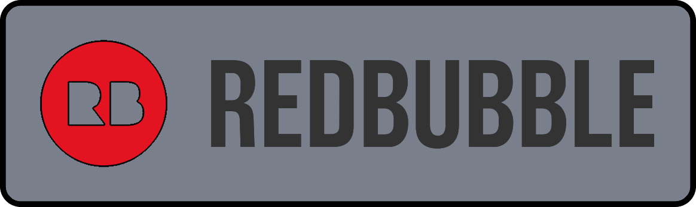

Alchemist is good, make one lol

Hardware: https://docs.google.com/spreadsheets/d/1YDkzYdij77of0HTidGjQzjRrs53viwXQVmcyhZj8VQ8/edit?usp=sharing

## Project Contributors

Thanks to the people who contributed to Alchemist! Here's a list of who did what (in no particular order): (click this text)

Beta:
- SuperStressed: Beta testing.
- Chance: Emotional support (Chance — 06/11/2023 8:16 PM: "succa my nut", 07/07/2023 5:48 PM: "lofts can suck my whole ass"). Adapted Vikinger's Skeggox stock to fit Alchemist. Did a bunch of work on the positioning of the primingblock bearings.
- zoomed_out_tahova: Beta testing.
- Wonderboy: Misc help.
- Hollebread: Beta testing.
- RedCowl: Misc help.
- Meaker VI: Did some fun stuff with the initial prototype. None of it made it back into the main design, but it's still pretty neat.
- TriangleFabrications: Misc help.
- Ian Whitehouse: Misc help.
- OOD Greg: Testing help and sourcing help.
- Hotkoin: Aesthetic assistance. 

## Misc.

**If you build any of my designs, I'd love to see yours! Feel free to message me on Discord (Sillybutts#5905) or tag me on a post on Reddit (u/SillyTheGamer).**

**If you are having issues with any of my designs, let me know on Discord (Sillybutts#5905) or Reddit (u/SillyTheGamer).**

**If you wish to print and sell this item, please contact me for licensing. I can be reached on Discord (Sillybutts#5905) or Reddit (u/SillyTheGamer). iamsillybutts@gmail.com email too.**
**你好！ 我擁有這個設計。 想生產請聯繫我. 你好！ 我拥有这个设计。 如果你想生产，请联系我.**

 This work is licensed under a <a rel="license" href="http://creativecommons.org/licenses/by-nc-sa/4.0/">Creative Commons Attribution-NonCommercial-ShareAlike 4.0 International License</a>.

**Disclaimer: This is not a toy. This blaster is meant for hobbyists, not children. Blaster must be operated correctly to avoid injury. I am not responsible for any injuries from this blaster. Please use a bright/blaze orange muzzle and barrel cap on this blaster. Consult local laws before building this high powered blaster.**

## If you like what I do, please consider supporting me!

**I don't charge for my files, so any donations or merch purchases would be greatly appreciated!**

 https://www.redbubble.com/people/Sillybutts/shop RedBubble full of fun Nerf-y sticker and merch designs!  

 https://www.patreon.com/sillybutts Monthly donations

 https://www.buymeacoffee.com/sillybutts One-time donations

## Images
